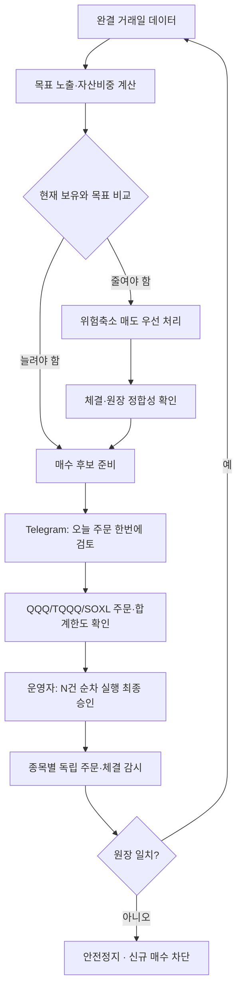

# JDSS 한 장 보고서 — 현재 운용판

> **한 문장 요약:** QQQ를 기본으로 보유하고 시장이 강할 때만 TQQQ·SOXL로 속도를 높이며, 위험이 커지면 자동으로 줄이고 매수만 사람이 최종 승인하는 전략입니다.

현재 실제 운영 전략은 **`JDSS-3.2.2-RS6M-ONEWAY-HWM75`**입니다. 정확한 숫자와 예외조건은 [`JDSS_FINAL_SPEC.md`](JDSS_FINAL_SPEC.md)와 [`../strategy.yaml`](../strategy.yaml), 현재 배포·실거래 상태는 [`../CURRENT_WORK.md`](../CURRENT_WORK.md)가 기준입니다.

현재 Oracle은 **실계좌 연결·신규 매수 잠금** 상태입니다. 실제 토스 계좌와 별도 실거래 원장은 연결됐지만, 운영자가 잠금을 풀기 전에는 신규 매수가 전송되지 않습니다. 위험축소 매도는 전략 규칙에 따라 자동 처리됩니다.

## 1. 무엇을 사나요?

| 자산 | 역할 | 쉽게 이해하기 |
|---|---|---|
| QQQ | 기본 자산 | 나스닥 100의 방향을 약 1배로 따라감 |
| TQQQ | 기술주 가속 | QQQ의 **일간** 움직임을 약 3배로 추종 |
| SOXL | 반도체 가속 | 반도체 지수의 **일간** 움직임을 약 3배로 추종 |
| USD 현금 | 위험 완충 | 변동성이 높을 때 일부를 투자하지 않음 |

TQQQ·SOXL의 장기 수익률이 기초지수의 정확히 3배가 되는 것은 아닙니다. 일간 재설정과 변동성 때문에 장기 경로가 달라질 수 있습니다.

## 2. 시장 속도는 어떻게 정하나요?

새 달 첫 거래일 종가가 확정되면 QQQ의 추세·수익률·변동성을 이용해 기본 목표 노출을 정합니다.

1. QQQ 20거래일 연환산 변동성 ≥ 30% → **0.5x**
2. QQQ ≤ SMA200 → **1.0x**
3. SMA50>SMA200이고 63일·126일 수익률이 모두 양수 → **1.5x**
4. 5개 추세조건 중 3개 이상 충족 → **1.25x**
5. 나머지 → **1.0x**

월중에는 위험이 커지면 빠르게 줄이고, 같은 달 안에서는 다시 공격적으로 올리지 않는 **빠른 위험축소·느린 위험확대** 구조입니다.

| 목표 노출 | 기본 구성 | 반도체 상대강도 ON |
|---:|---|---|
| 0.5x | QQQ 50% + 현금 50% | 동일 |
| 1.0x | QQQ 100% | 동일 |
| 1.25x | QQQ 87.5% + TQQQ 12.5% | QQQ 87.5% + TQQQ 6.25% + SOXL 6.25% |
| 1.5x | QQQ 75% + TQQQ 25% | QQQ 75% + TQQQ 12.5% + SOXL 12.5% |

**RS6M**은 SOXX의 약 6개월(126거래일) 수익률이 0보다 크고 QQQ보다 높은지를 보는 규칙입니다. 조건이 깨지면 SOXL 부분을 TQQQ로 줄이고, 그달에는 SOXL을 다시 늘리지 않습니다.

## 3. 추가 레버리지는 최대 5%

기존 H40-S3 과매도·반등 로직은 독립 자금으로 따로 주문하지 않고 **QQQ 일부를 TQQQ/SOXL로 바꾸는 최대 5% 추가 레버리지 판단**에만 사용합니다.

- TQQQ 조건만 활성 → QQQ 최대 5%를 TQQQ로 이동
- SOXL 조건만 활성 → QQQ 최대 5%를 SOXL로 이동
- 둘 다 활성 → 총 5%를 2.5%씩 나눔

Telegram 사용자 화면에서는 어려운 내부 용어보다 **`TQQQ 추가매수 판단` / `SOXL 추가매수 판단`**처럼 표시합니다.

## 4. HWM75는 무엇인가요?

시작 위험원금은 **$50,000**입니다. 계좌가 새 최고점을 만들면 초과이익의 75%만 다음 위험예산 증가에 사용합니다.

`위험예산 = min(현재 평가액, 50,000 + 0.75 × max(0, 최고 평가액 - 50,000))`

예를 들어 $50,000이 $60,000이 되면 전체 $60,000을 위험자금으로 다시 쓰는 것이 아니라 **$57,500**까지만 위험예산으로 인정합니다. 나머지 이익 25%는 JDSS 현금으로 남지만 추가 위험 확대에는 사용하지 않습니다.

## 5. 실제 하루 주문 흐름

평소 사용자는 `/dashboard`에서 **`오늘 주문 한번에 검토`**만 기억하면 됩니다.

- 주문은 미국 장전·정규장·장후에 가능하며 지정가만 사용합니다.
- Toss 현재가 시각을 필수로 확인하고 5분을 초과한 구 가격으로는 주문을 계산하지 않습니다.
- 매도가 필요하면 시스템이 먼저 위험을 줄입니다.
- 매수가 필요하면 QQQ/TQQQ/SOXL을 한 화면에 모아 보여줍니다.
- 사용자가 최종 버튼을 한 번 누르면 각 종목을 **순서대로 독립 제출**합니다.
- 순차 실행은 모든 종목이 한 번에 처리되는 단일 주문이 아니므로 중간에 조건이 달라지면 앞 주문만 제출되고 뒤 주문은 중단될 수 있습니다.
- 최종 클릭 직전에 계좌 대조·가격·수량·주문시간·HWM75 한도를 다시 검사합니다.

세부 상태와 버튼 의미는 [`TELEGRAM_BOT_GUIDE.md`](TELEGRAM_BOT_GUIDE.md)를 따릅니다.

## 6. 처음 계좌에 적용할 때

처음부터 최종 목표를 한 번에 매수하지 않습니다.

- 1차: 최종 목표의 누적 **50%**
- 최소 3 미국 거래일 후 2차: **75%**
- 다시 최소 3 미국 거래일 후 3차: **100%**

다음 단계는 자동으로 열리지 않고 운영자가 `/onboarding`에서 승인합니다. 단계만 열어도 주문이 자동 제출되는 것은 아니며 실제 매수는 다시 `오늘 주문 확인` 흐름을 거칩니다.

## 7. 기준 과거검증

최근 공식 V3.2.2 재현 결과(2011-01-01~2026-08-24, 초기 $50,000, 매수·매도 수수료 각 0.1%, 가격 미끄러짐 0.1%, 다음 거래시간 체결)는 다음과 같습니다.

| 지표 | V3.2.2 | 해석 |
|---|---:|---|
| 누적수익률 | **+2,111.20%** | $50,000 → 약 $1.106M |
| CAGR | **21.89%** | 장기 연평균 복리수익률 |
| MDD | **-30.94%** | 가장 큰 고점 대비 낙폭 |
| Sharpe | **0.987** | 변동성 대비 수익의 참고값 |
| Sortino | **1.295** | 하방 변동 중심 위험조정 지표 |
| 평균 시장노출 | **80.65%** | 항상 100% 투자하지 않았음 |

과거 동일 조건 QQQ 단순보유 비교에서는 JDSS가 더 높은 CAGR과 더 작은 MDD를 보였지만, 데이터 공급자의 조정값은 시간이 지나며 소폭 바뀔 수 있습니다. 정확한 승인 기준과 최근 연도별 값은 [`STRATEGY_GUIDE.md`](STRATEGY_GUIDE.md)를 확인합니다.

## 8. 장점과 한계

### 장점

- 상승 추세에서 제한적으로 레버리지를 사용하고 고변동 시 빠르게 감속합니다.
- SOXL은 반도체 상대강도가 있을 때만 제한적으로 사용합니다.
- HWM75로 이익 전부를 다시 위험에 노출하지 않습니다.
- 위험축소 매도를 매수보다 먼저 처리합니다.
- 매수는 운영자가 승인하고, 중복주문·한도초과·원장 불일치가 있으면 확인될 때까지 차단합니다.

### 한계

- 매년 QQQ를 이기는 전략이 아닙니다.
- TQQQ·SOXL은 급락·횡보장에서 손실과 변동성 드래그가 큽니다.
- 2023년 이후 데이터는 연구 과정에서 반복 관찰되어 완전히 독립된 검증기간으로 보기 어렵습니다.
- 과거검증은 미래수익을 보장하지 않습니다.
- 배포가 성공했다고 실제 Toss 주문이 자동으로 활성화되지 않습니다.

## 9. 미니 용어사전

| 용어 | 뜻 |
|---|---|
| 목표 노출 1.5x | 포트폴리오가 QQQ 방향에 대략 1.5배 민감하도록 만든 목표 |
| SMA50 / SMA200 | 최근 50 / 200거래일 종가 평균선 |
| 모멘텀 | 일정 기간 가격이 얼마나 상승·하락했는지 |
| 연환산 변동성 | 최근 일간 흔들림을 1년 기준으로 환산한 값 |
| RS6M | 약 6개월 기준 반도체가 QQQ보다 강한지 비교하는 규칙 |
| HWM75 | 최고점 이익의 75%만 투자한도 증가에 반영하는 규칙 |
| MDD | 최고점 이후 가장 크게 빠진 비율 |
| Sharpe | 전체 변동성 대비 수익의 위험조정 참고지표 |
| 안전정지(SAFE_MODE) | 주문·원장 상태가 불확실할 때 신규 매수를 막는 보호 상태 |
| 계좌·원장 대조 | 프로그램 기록과 실제 주문·보유 상태가 맞는지 확인하는 절차 |

더 자세한 설명은 [`STRATEGY_GUIDE.md`](STRATEGY_GUIDE.md), 정확한 구현 계약은 [`JDSS_FINAL_SPEC.md`](JDSS_FINAL_SPEC.md)를 따릅니다.
