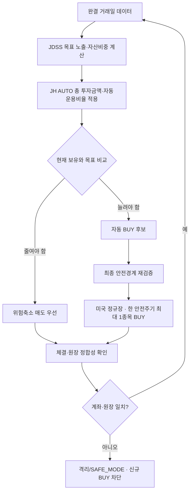

# JDSS 한 장 보고서 — 현재 운용판

> **버전 구분:** 투자판단은 `JDSS 3.2.2`, 실제 자동주문·자금·안전·성과회계는 `JH AUTO 1.0.0`이 담당합니다. 자동운용의 단일 기준은 [`JH_AUTO_SPEC.md`](JH_AUTO_SPEC.md)입니다.

> **한 문장 요약:** QQQ를 기본으로 두고 시장이 강할 때만 TQQQ·SOXL로 속도를 높이며, JH AUTO가 운영자가 정한 총 투자금액과 자동운용비율 범위 안에서만 실제 주문을 실행합니다.

현재 투자전략은 **`JDSS-3.2.2-RS6M-ONEWAY-HWM75`**, 자동매매 실행계층은 **`JH AUTO 1.0.0`**입니다. 전략 숫자는 [`JDSS_FINAL_SPEC.md`](JDSS_FINAL_SPEC.md)와 [`../strategy.yaml`](../strategy.yaml), 현재 배포·실거래 상태는 [`../CURRENT_WORK.md`](../CURRENT_WORK.md)가 기준입니다.

중요한 구분은 다음과 같습니다.

- `strategy.yaml`의 `$50,000`은 **JDSS 3.2.2 공식 연구·백테스트·회귀검증 기준 예시자금**입니다.
- 실제 실거래 총 투자금액은 운영자가 Telegram `/auto`에서 정합니다.
- 자동운용 원금은 `총 투자금액 × 자동운용비율`입니다.
- LIVE에서 JH AUTO 자금상태가 누락·손상되면 연구 기준 `$50,000`으로 되돌아가지 않고 신규 BUY를 차단합니다.
- 코드 배포만으로 자동매매가 시작되지 않습니다. 최초 실제 BUY 권한은 운영자의 별도 Telegram 시작승인 후에만 생깁니다.

## 1. 무엇을 사나요?

| 자산 | 역할 | 쉽게 이해하기 |
|---|---|---|
| QQQ | 기본 자산 | 나스닥 100의 방향을 약 1배로 따라감 |
| TQQQ | 기술주 가속 | QQQ의 **일간** 움직임을 약 3배로 추종 |
| SOXL | 반도체 가속 | 반도체 지수의 **일간** 움직임을 약 3배로 추종 |
| USD 현금 | 위험 완충 | 변동성이 높을 때 일부를 투자하지 않음 |

TQQQ·SOXL의 장기 수익률이 기초지수의 정확히 3배가 되는 것은 아닙니다. 일간 재설정과 변동성 때문에 장기 경로가 달라질 수 있습니다.

## 2. 시장 속도는 어떻게 정하나요?

QQQ의 추세·수익률·변동성을 이용해 기본 목표 노출을 정합니다.

1. QQQ 20거래일 연환산 변동성 ≥ 30% → **0.5x**
2. QQQ ≤ SMA200 → **1.0x**
3. SMA50>SMA200이고 63일·126일 수익률이 모두 양수 → **1.5x**
4. 5개 추세조건 중 3개 이상 충족 → **1.25x**
5. 나머지 → **1.0x**

월중에는 위험이 커지면 빠르게 줄이고, 같은 달 안에서는 다시 공격적으로 올리지 않는 **빠른 위험축소·느린 위험확대** 구조입니다.

| 목표 노출 | 기본 구성 | 반도체 상대강도 ON |
|---:|---|---|
| 0.5x | QQQ 50% + 현금 50% | 동일 |
| 1.0x | QQQ 100% | 동일 |
| 1.25x | QQQ 87.5% + TQQQ 12.5% | QQQ 87.5% + TQQQ 6.25% + SOXL 6.25% |
| 1.5x | QQQ 75% + TQQQ 25% | QQQ 75% + TQQQ 12.5% + SOXL 12.5% |

**RS6M**은 SOXX의 약 6개월(126거래일) 수익률이 0보다 크고 QQQ보다 높은지를 보는 규칙입니다. 조건이 깨지면 SOXL 부분을 TQQQ로 줄이고, 그달에는 SOXL을 다시 늘리지 않습니다.

## 3. 추가 레버리지는 최대 5%

기존 H40-S3 과매도·반등 로직은 독립 자금으로 따로 주문하지 않고 **QQQ 일부를 TQQQ/SOXL로 바꾸는 최대 5% 추가 레버리지 판단**에만 사용합니다.

- TQQQ 조건만 활성 → QQQ 최대 5%를 TQQQ로 이동
- SOXL 조건만 활성 → QQQ 최대 5%를 SOXL로 이동
- 둘 다 활성 → 총 5%를 2.5%씩 나눔

## 4. `$50,000`과 실제 투자금액은 다릅니다

JDSS 3.2.2의 공식 과거검증은 비교 가능성을 위해 `$50,000`을 기준자금으로 유지합니다. 그러나 이 값은 실제 계좌에 반드시 넣어야 하는 고정 원금이 아닙니다.

실거래에서는 운영자가 Telegram에서 두 값을 정합니다.

```text
총 투자금액       $50,000   ← 운영자가 변경 가능
자동운용비율           20%   ← 운영자가 1~100% 지정
목표 자동원금      $10,000
```

실제 목표수량은 목표 자동원금과 JDSS 목표비중을 이용해 정수주 단위로 새로 계산합니다. `$50,000` 기준 목표주식수를 만든 뒤 단순히 20%를 곱하지 않습니다.

## 5. HWM75는 무엇인가요?

공식 JDSS 백테스트에서는 기준원금 `C0=$50,000`으로 비교합니다. 실제 JH AUTO 운용에서는 **현재 운영자가 허용한 자동운용 원금**이 `C0`가 됩니다.

`HWM75 위험예산 = min(현재 평가액, C0 + 0.75 × max(0, 최고 평가액 - C0))`

예를 들어 현재 허용원금이 `$10,000`이고 자동운용자산 최고점이 `$12,000`이면 다음 위험예산은 약 `$11,500`입니다. 운영자가 자금을 추가하거나 회수한 금액은 투자수익으로 계산하지 않습니다.

## 6. 실제 하루 주문 흐름



JH AUTO 1.0.0의 신규 자동 BUY는 미국 **정규장만** 허용합니다. 주문을 제출하기 직전에 실제 현재시각, 총 투자금액×자동운용비율, 현재 허용원금, HWM75, 미체결 예약, BUY halt, SAFE_MODE를 다시 검사합니다.

주문 결과가 `UNKNOWN`이면 같은 주문을 자동 재전송하지 않고 신규 BUY를 차단한 뒤 실제 Toss 상태 확인을 우선합니다.

## 7. 최초 시작과 자금확대

처음부터 목표 자동원금 전부를 열지 않습니다.

- 1단계: 목표 자동원금의 **50%**
- 2단계: **75%**
- 3단계: **100%**

각 단계는 목표 체결·계좌대조·안전상태·최소 거래세션 조건을 충족해야 진행합니다. 초기 파일럿은 실제 자동주문 체결 증거가 한 번도 없으면 단순히 목표수량이 0주라는 이유로 다음 단계로 승격하지 않습니다.

자동운용비율을 늘릴 때는 추가로 위임한 자금만 단계적으로 열고, 줄일 때는 위험축소 목표를 지연하지 않습니다. 자동운용비율을 시스템이 스스로 높일 수는 없습니다.

## 8. 최초 시작승인은 배포와 별개입니다

배포 직후 기본 계약은 다음과 같습니다.

```text
코드 배포             완료 가능
시장/계좌 조회         가능
Telegram 설정          가능
최초 자동운용 시작승인  미승인
실제 신규 BUY          차단
```

운영자가 `/auto start`의 2단계 확인을 완료하기 전에는 실제 BUY가 나가면 안 됩니다. 시작확인 버튼 자체도 주문을 보내지 않으며, 이후 별도의 안전주기에서 모든 조건을 새로 검사해야 첫 주문이 가능합니다.

`/halt`는 대표 긴급정지입니다. 시스템 임시격리와 별개이며 시스템이 스스로 `/halt`를 해제할 수 없습니다.

## 9. 성과 표시는 어떻게 보나요?

`/dashboard`에는 포트폴리오 전체 자동운용자산, 누적손익, 누적수익률을 표시합니다. `/portfolio`와 `/today`에는 QQQ/TQQQ/SOXL 현재 보유분의 평가손익·보유수익률과 전체 합계 성과를 함께 보여줍니다.

총 투자금액이나 자동운용비율이 중간에 바뀌어도 입출금을 수익으로 오해하지 않도록 JH AUTO는 단위가치 기반 시간가중 성과를 사용합니다.

## 10. 공식 과거검증

최근 공식 V3.2.2 재현 결과(2011-01-01~2026-08-24, **연구 기준 초기자금 $50,000**, 매수·매도 수수료 각 0.1%, 가격 미끄러짐 0.1%, 다음 거래시간 체결)는 다음과 같습니다.

| 지표 | V3.2.2 | 해석 |
|---|---:|---|
| 누적수익률 | **+2,111.20%** | $50,000 → 약 $1.106M |
| CAGR | **21.89%** | 장기 연평균 복리수익률 |
| MDD | **-30.94%** | 가장 큰 고점 대비 낙폭 |
| Sharpe | **0.987** | 변동성 대비 수익의 참고값 |
| Sortino | **1.295** | 하방 변동 중심 위험조정 지표 |
| 평균 시장노출 | **80.65%** | 항상 100% 투자하지 않았음 |

### QQQ 단순보유 비교

공식 검증은 같은 기간의 QQQ 단순보유 비교도 함께 확인합니다. 이 비교는 JDSS가 항상 QQQ를 이긴다는 뜻이 아니라, 동일한 시장기간에서 수익률·MDD·위험조정 성과를 평가하기 위한 기준선입니다. 정확한 최신 비교수치는 [`STRATEGY_GUIDE.md`](STRATEGY_GUIDE.md)와 공식 백테스트 결과를 따릅니다.

이 `$50,000`은 과거결과를 동일한 조건으로 비교하기 위한 연구 기준이며 실제 사용자가 선택하는 총 투자금액과는 별개입니다. **과거검증은 미래수익을 보장하지 않습니다.**

## 11. 장점과 한계

### 장점

- 상승 추세에서 제한적으로 레버리지를 사용하고 고변동 시 빠르게 감속합니다.
- SOXL은 반도체 상대강도가 있을 때만 제한적으로 사용합니다.
- HWM75로 이익 전부를 다시 위험에 노출하지 않습니다.
- 위험축소 매도를 매수보다 먼저 처리합니다.
- 실제 BUY는 운영자가 정한 자금한도와 다중 안전경계를 모두 통과해야 합니다.
- 배포, 서버 재시작, 설정변경만으로 첫 자동 BUY가 활성화되지 않습니다.

### 한계

- 매년 QQQ를 이기는 전략이 아닙니다.
- TQQQ·SOXL은 급락·횡보장에서 손실과 변동성 드래그가 큽니다.
- 정수주 때문에 아주 작은 자동운용 원금에서는 목표비중 재현오차가 커질 수 있습니다.
- 브로커 주문 결과가 본질적으로 불명확한 경우에는 완전 무인 복구보다 안전정지를 우선합니다.
- 과거검증은 미래수익을 보장하지 않습니다.

## 12. 미니 용어사전

| 용어 | 뜻 |
|---|---|
| JDSS 3.2.2 | 시장상태와 QQQ/TQQQ/SOXL 목표비중을 결정하는 투자전략 |
| JH AUTO 1.0.0 | 실제 자금·주문·안전·성과를 관리하는 자동매매 실행계층 |
| 총 투자금액 | 운영자가 Telegram에서 정하는 실거래 기준 원금 |
| 자동운용비율 | 총 투자금액 중 JH AUTO에 위임할 비율 |
| 현재 허용원금 | 50→75→100 단계에 따라 현재 실제 위험예산에 사용할 수 있는 원금 |
| RS6M | 약 6개월 기준 반도체가 QQQ보다 강한지 비교하는 규칙 |
| HWM75 | 최고점 이익의 75%만 위험한도 증가에 반영하는 규칙 |
| UNKNOWN | 주문 요청의 실제 브로커 처리 결과를 확정할 수 없는 상태; 자동 재전송 금지 |
| 안전정지(SAFE_MODE) | 주문·원장 상태가 불확실할 때 신규 매수를 막는 보호 상태 |
| 계좌·원장 대조 | 프로그램 기록과 실제 주문·보유 상태가 맞는지 확인하는 절차 |

더 자세한 전략 설명은 [`STRATEGY_GUIDE.md`](STRATEGY_GUIDE.md), 자동운용 계약은 [`JH_AUTO_SPEC.md`](JH_AUTO_SPEC.md), 정확한 전략 구현계약은 [`JDSS_FINAL_SPEC.md`](JDSS_FINAL_SPEC.md)를 따릅니다.
