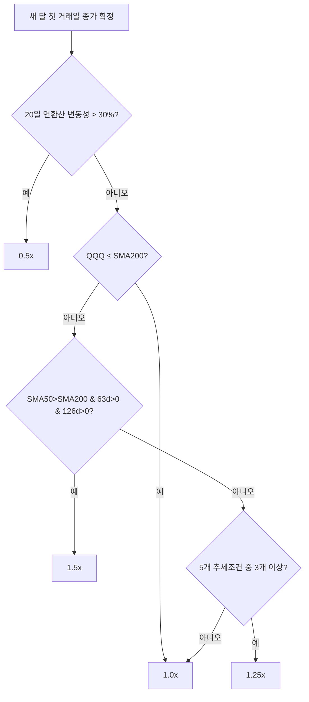
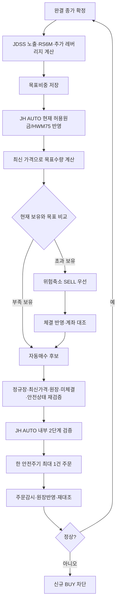

# JDSS 3.2.2 쉬운 전략 가이드

> **전략/실행 분리:** 이 문서는 `JDSS 3.2.2`의 시장판단과 목표비중을 설명합니다. 실제 자금설정·자동주문·최초 시작·정지·복구는 [`JH_AUTO_SPEC.md`](JH_AUTO_SPEC.md)의 `JH AUTO 1.0.0`이 담당합니다.

빠른 요약은 [`ONE_PAGE_REPORT.md`](ONE_PAGE_REPORT.md), 투자전략의 최종 계약은 [`JDSS_FINAL_SPEC.md`](JDSS_FINAL_SPEC.md)와 [`../strategy.yaml`](../strategy.yaml), 현재 배포상태는 [`../CURRENT_WORK.md`](../CURRENT_WORK.md)를 따릅니다.

## 1. 전략의 큰 그림

JDSS 3.2.2는 QQQ·TQQQ·SOXL의 **목표비중**을 결정합니다.

1. **시장 속도 조절** — QQQ를 기준으로 목표 노출을 0.5 / 1.0 / 1.25 / 1.5x 중 하나로 결정
2. **반도체 선택** — 레버리지 부분을 TQQQ에 둘지 TQQQ·SOXL로 나눌지 결정
3. **최대 5% 추가 레버리지 판단** — H40-S3 가상 사이클이 켜질 때 QQQ 일부를 TQQQ/SOXL로 교체
4. **HWM75** — 수익 전부를 다시 위험에 걸지 않도록 위험예산을 제한

핵심 철학은 **빠른 위험축소·느린 위험확대**입니다.

## 2. 시장 노출 0.5 / 1.0 / 1.25 / 1.5x

새 달 첫 거래일 종가가 완전히 확정된 뒤 다음 순서로 판단합니다.

### 2.1 변동성 브레이크

QQQ의 20거래일 일간수익률 표준편차를 연환산한 값이 **30% 이상**이면 목표 노출을 **0.5x**로 낮춥니다. 월중에 새로 30%를 넘겨도 즉시 감속하며 같은 달 안에서 쉽게 재가속하지 않습니다.

### 2.2 장기 추세와 추세 투표

- QQQ 종가 ≤ SMA200 → **1.0x**
- SMA50>SMA200이고 63일·126일 수익률이 모두 양수 → **1.5x**
- 아래 다섯 조건 중 3개 이상 → **1.25x**
- 나머지 → **1.0x**

다섯 조건:

1. 21거래일 수익률 > 0
2. 63거래일 수익률 > 0
3. 126거래일 수익률 > 0
4. SMA50 > SMA200
5. SMA200의 21거래일 기울기 > 0

지표 warmup이 충분하지 않으면 1.0x를 사용합니다.



## 3. 목표 노출을 ETF 비중으로 바꾸는 법

1.0x를 넘는 부분은 3배 ETF로 합성합니다.

```text
3배 ETF 비중 = (목표 노출 - 1) / 2
```

| 목표 노출 | QQQ | 3배 ETF 부분 | 현금 |
|---:|---:|---:|---:|
| 0.5x | 50% | 0% | 50% |
| 1.0x | 100% | 0% | 0% |
| 1.25x | 87.5% | 12.5% | 0% |
| 1.5x | 75% | 25% | 0% |

예를 들어 QQQ 75% + TQQQ 25%는 `0.75×1 + 0.25×3 = 1.5x`입니다.

## 4. RS6M: SOXL 사용 조건

SOXX와 QQQ의 126거래일 수익률을 비교합니다.

**RS6M ON**:

- SOXX 126일 수익률 > 0
- SOXX 126일 수익률 > QQQ 126일 수익률

동작:

- OFF → 3배 ETF 부분을 TQQQ 100%
- ON → 3배 ETF 부분을 TQQQ 50% + SOXL 50%
- 월중 조건 상실 → SOXL 부분을 TQQQ로 후퇴
- 한 번 SOXL에서 이탈한 달 → 다음 월 reset 전까지 SOXL 재진입 금지

SOXL은 항상 보유하는 자산이 아니라 **반도체의 중기 상대강도가 확인될 때만 제한적으로 사용하는 자산**입니다.

## 5. 최대 5% 추가 레버리지

기존 H40-S3의 CCI·RSI·볼린저밴드·반등·거래량·ATR 점수와 가상 사이클은 계속 계산하지만 별도 독립 포지션으로 주문하지 않습니다.

- TQQQ 가상 사이클만 활성 → QQQ 최대 5%를 TQQQ로 교체
- SOXL 가상 사이클만 활성 → QQQ 최대 5%를 SOXL로 교체
- 둘 다 활성 → 총 5%를 2.5%씩 분배

가상 active 상태는 미래 데이터 사용을 막기 위해 한 거래일 지연해 반영합니다.

## 6. HWM75: 수익 전부를 다시 위험에 걸지 않기

HWM75의 전략 공식은 **금액 자체가 아니라 현재 위험원금 `P`에 적용되는 공식**입니다.

```text
위험예산 = min(
  현재 평가액 E,
  P + 0.75 × max(0, 최고 평가액 H - P)
)
```

JDSS 공식 백테스트에서는 비교 일관성을 위해 `P=$50,000`을 사용합니다. 이 `$50,000`은 **공식 연구·백테스트 기준값**이지 실거래 고정원금이 아닙니다.

실거래 JH AUTO에서는 `P`가 대표가 정한 운용 기준자금 자체도 아니고, **현재 자금투입 단계까지 실제로 열린 현재 허용원금**입니다.

예:

```text
운용 기준자금       $50,000
자동운용비율            20%
목표 자동원금       $10,000
1단계 현재 허용원금  $5,000
```

1단계 직후 HWM75는 `$5,000`에서 시작합니다. 최종적으로 현재 허용원금이 `$10,000`이 된 뒤 최고 자동운용자산이 `$12,000`이라면 위험예산은 약 `$11,500`입니다.

운용 기준자금·자동운용비율 변경으로 들어오거나 빠지는 돈은 투자수익으로 계산하지 않습니다.

핵심:

- 이익의 25%는 추가 위험확대에서 제외
- 손실이 나도 외부 개인현금을 자동 투입해 원금을 복구하지 않음
- `$50,000` 연구 기준과 실거래 자금설정을 혼동하지 않음

## 7. 전략 목표에서 실제 주문까지

JDSS는 **무엇을 얼마나 보유할지** 결정하고, JH AUTO는 **실제로 주문해도 되는지** 결정합니다.



JH AUTO 1.0.0의 자동 allocation 주문은 **미국 정규장에만 실행**합니다. 전략 설정에 남아 있는 장전·장후 세션 값은 기존/수동 경로 호환 설정이며 현재 JH AUTO 자동 allocation 실행시간을 의미하지 않습니다.

정상 AUTO 운영에서 개별 매수의 `주문 묶음 검토`나 사람이 누르는 `최종 승인`은 기본 경로가 아닙니다. 기존 review/execution approval 코드는 내부 안전검증으로 재사용됩니다.

## 8. 최초 실전 진입 50% → 75% → 100%

JH AUTO는 **목표 자동원금 전체를 첫날 한 번에 열지 않습니다.**

목표 자동원금이 `$10,000`이면:

| 단계 | 현재 허용원금 | 다음 단계 핵심조건 |
|---|---:|---|
| 1차 | $5,000 | 실제 AUTO 체결 + 목표충족 + 정합성 + 최소 3 미국 거래세션 |
| 2차 | $7,500 | 실제 AUTO 체결 + 목표충족 + 정합성 + 최소 3 미국 거래세션 |
| 3차 | $10,000 | 실제 AUTO 체결 + 목표충족 후 완료 |

단순히 정수주 반올림으로 목표수량이 0이거나 시간이 지났다는 이유만으로 자금을 자동 확대하지 않습니다. 각 단계마다 실제 AUTO 체결 증거가 필요합니다.

이 단계는 `/auto`에서 확인합니다. 과거 `/onboarding` 수동 단계는 JH AUTO 시작 시 중복 적용되지 않도록 완료처리됩니다.

운용 기준자금이나 자동운용비율을 나중에 올리면 **추가된 원금만** 다시 50→75→100으로 엽니다. 감액은 단계대기 없이 위험축소 목표에 반영합니다.

## 9. 실거래 원장과 실제 Toss 계좌

| 구분 | 역할 |
|---|---|
| JH AUTO/JDSS 실거래 원장 | 관리자금·목표·주문·체결·성과의 내부 기준 |
| 실제 Toss 계좌 | 실제 보유·미체결·매수가능금액의 외부 확인 기준 |
| 과거 모의운용 원장 | 시험 기록이며 실거래 수량으로 자동 채택하지 않음 |

QQQ·TQQQ·SOXL은 원장과 Toss를 계속 대조합니다. 둘이 다르면 성공으로 추정하지 않고 신규 BUY를 차단합니다.

같은 Toss 계좌에서 QQQ/TQQQ/SOXL을 수동으로 동시에 거래하지 않는 것이 운영 원칙입니다. 다른 비관리 종목은 JDSS 목표비중에 포함하지 않습니다.

## 10. 대표적인 운영 이상상황

| 상황 | 안전한 처리 |
|---|---|
| 주문 응답이 불명확 | `UNKNOWN` → 자동 재주문 금지·신규 BUY 차단 |
| BUY 미체결이 오래 지속 | 취소 요청 → 원주문 상태 재확인 → 불명확하면 SAFE_MODE |
| 위험축소 SELL 부분체결·미완료 | 신규 BUY 차단 |
| Toss/원장 보유 불일치 | 신규 BUY 차단·정합성 확인 |
| 검토 이후 가격·수량 변경 | 기존 내부 approval 폐기 후 최신값 재계산 |
| 서버 재시작 | startup quarantine에서 주문·계좌·원장 재검증 |
| 대표 `/halt` | durable latch 설정·시스템 자동해제 금지 |
| 오래된 Telegram 설정 버튼 | token/TTL/현재상태와 다르면 거부 |
| 이중 runtime | 동일 live 원장 OS 파일잠금으로 두 번째 프로세스 차단 |

세부 안전 불변식은 [`infra/SECURITY.md`](infra/SECURITY.md)가 소유합니다.

## 11. 기준 과거검증

최근 공식 V3.2.2 재현 조건:

- 기간: 2011-01-01 ~ 2026-08-24
- **연구 기준 초기자금: $50,000**
- 매수/매도 수수료: 각 0.1%
- 가격 미끄러짐: 0.1%
- 다음 거래시간 체결
- HWM75
- SGOV OFF
- 첫 투자 50% → 75% → 100% 거래일 한도 반영

| 지표 | V3.2.2 |
|---|---:|
| 누적수익률 | **+2,111.20%** |
| 연평균 복리수익률(CAGR) | **21.89%** |
| 최대낙폭(MDD) | **-30.94%** |
| 변동성 대비 수익(Sharpe) | **0.987** |
| 하락변동 대비 수익(Sortino) | **1.295** |
| 수익률·낙폭 비율(Calmar) | **0.708** |
| 평균 노출 | **80.65%** |
| 목표비중 조정 체결 | **861건** |

최근 연도:

| 연도 | V3.2.2 |
|---|---:|
| 2022 | -27.88% |
| 2023 | +58.88% |
| 2024 | +32.49% |
| 2025 | +18.98% |
| 2026 YTD (8/24) | +23.33% |

자동검사는 공급자 수정주가의 소폭 변경을 감안해 **CAGR 21.7~22.8%, MDD -31.6~-30.3%, Sharpe 0.94~1.07**의 좁은 재현 범위를 사용합니다.

### QQQ 단순보유 비교

같은 기간 QQQ 단순보유도 기준선으로 비교합니다. 과거 동일 조건에서 JDSS 3.2.2가 장기 CAGR과 MDD에서 우위였지만 매년 이긴 것은 아니며, 과거검증은 미래수익을 보장하지 않습니다.

## 12. 강건성 경고

- SOXL sleeve·RS lookback·대체 proxy·월 reset 날짜 주변값에서도 즉시 붕괴하는 단일점 구조는 아니었습니다.
- 비용을 높인 조건에서도 장기 방향성은 유지됐습니다.
- 2023년 이후 데이터는 후보선택 과정에서 반복 관찰되어 완전히 독립된 검증기간이 아닙니다.
- 과거 조합검증 기준 과최적화 확률 추정치는 약 **64.29%**로 경고 수준입니다.
- 새 연구는 [`research/RESEARCH_PROTOCOL.md`](research/RESEARCH_PROTOCOL.md)의 독립검증·인접값·재표본검증 기준을 따릅니다.

## 13. 평소 운영 체크리스트

- `/dashboard`: 자동운용 전체 상태·수익률·자금범위 확인
- `/today`: 오늘 목표수량과 자동매수/위험축소 필요량 확인
- `/auto`: 운용 기준자금·자동운용비율·자금투입 단계 확인/변경
- `/portfolio`: 종목별 보유·평가손익·수익률 확인
- `/account`: 실제 Toss 계좌 확인
- `/halt`: 이상 시 신규 BUY 즉시 차단
- 주문 결과가 불명확하면 재주문하지 않고 상태확인
- 배포와 `/auto start`를 같은 행위로 해석하지 않음

Telegram의 정확한 명령·상태·메시지는 [`TELEGRAM_BOT_GUIDE.md`](TELEGRAM_BOT_GUIDE.md)를 따릅니다.
