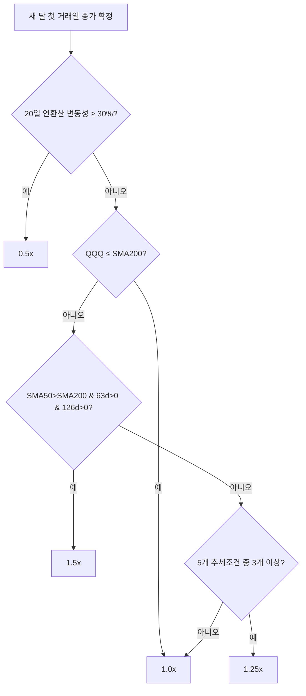
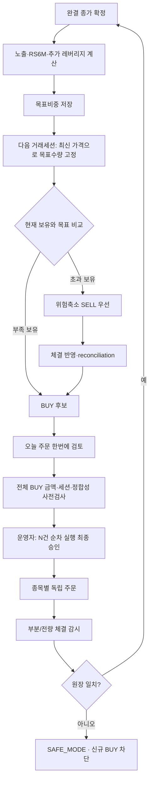

# JDSS 쉬운 전략·거래 가이드 — 현재 운용판

이 문서는 **JDSS V3.2.2를 이해하기 위한 상세 설명서**입니다. 빠른 요약은 [`ONE_PAGE_REPORT.md`](ONE_PAGE_REPORT.md), 숫자·예외조건의 최종 계약은 [`JDSS_FINAL_SPEC.md`](JDSS_FINAL_SPEC.md)와 [`../strategy.yaml`](../strategy.yaml)을 따릅니다.

현재 배포·dry-run/live 상태는 [`../CURRENT_WORK.md`](../CURRENT_WORK.md)에서만 확인합니다.

## 1. 전략의 큰 그림

JDSS V3.2.2는 세 가지 판단을 합쳐 QQQ·TQQQ·SOXL의 **목표비중**을 만들고, 현재 보유수량과의 차이만 거래합니다.

1. **시장 속도 조절** — QQQ 노출을 0.5 / 1.0 / 1.25 / 1.5x 중 하나로 결정
2. **반도체 선택** — 레버리지 부분을 TQQQ에만 둘지 TQQQ·SOXL로 나눌지 결정
3. **최대 5% 추가 레버리지 판단** — 기존 H40-S3 과매도·반등 로직이 켜질 때 QQQ 일부를 TQQQ/SOXL로 교체

핵심 철학은 **risk-off fast / risk-on slow**입니다. 위험이 커질 때는 월중에도 줄일 수 있지만, 한 번 줄인 위험을 같은 달 안에서 쉽게 다시 늘리지 않습니다.

## 2. 시장 노출 0.5 / 1.0 / 1.25 / 1.5x

새 달 첫 거래일 종가가 완전히 확정된 뒤 다음 순서로 판단합니다.

### 2.1 변동성 브레이크

QQQ의 20거래일 일간수익률 표준편차를 연환산한 값이 **30% 이상**이면 다른 조건이 좋아도 목표 노출을 **0.5x**로 낮춥니다.

월중에 새로 30%를 넘겨도 즉시 감속합니다. 같은 달 안에서 변동성이 다시 낮아졌다고 자동 재가속하지는 않습니다.

### 2.2 장기 추세와 추세 투표

변동성 브레이크가 아니라면 다음을 봅니다.

- QQQ 종가 ≤ SMA200 → **1.0x**
- SMA50>SMA200이고 63일·126일 수익률이 모두 양수 → **1.5x**
- 아래 다섯 조건 중 3개 이상 → **1.25x**
- 나머지 → **1.0x**

다섯 조건은 다음과 같습니다.

1. 21거래일 수익률 > 0
2. 63거래일 수익률 > 0
3. 126거래일 수익률 > 0
4. SMA50 > SMA200
5. SMA200의 21거래일 기울기 > 0

지표 warmup이 충분하지 않으면 1.0x를 사용합니다.

## 3. 목표 노출을 실제 ETF로 바꾸는 법

1.0x를 넘는 부분은 3배 ETF로 합성합니다.

`3배 ETF 비중 = (목표 노출 - 1) / 2`

예를 들어 QQQ 75% + TQQQ 25%는 `0.75×1 + 0.25×3 = 1.5x`입니다.

| 목표 노출 | QQQ | 3배 ETF 부분 | 현금 |
|---:|---:|---:|---:|
| 0.5x | 50% | 0% | 50% |
| 1.0x | 100% | 0% | 0% |
| 1.25x | 87.5% | 12.5% | 0% |
| 1.5x | 75% | 25% | 0% |

## 4. RS6M: SOXL을 언제 쓰나요?

SOXX와 QQQ의 126거래일 수익률을 비교합니다.

**RS6M ON** 조건:

- SOXX 126일 수익률 > 0
- SOXX 126일 수익률 > QQQ 126일 수익률

동작은 다음과 같습니다.

- OFF → 3배 ETF 부분을 **TQQQ 100%**
- ON → 3배 ETF 부분을 **TQQQ 50% + SOXL 50%**
- 월중 조건 상실 → SOXL 부분을 TQQQ로 후퇴
- 한 번 SOXL에서 이탈한 달 → 다음 월 reset 전까지 SOXL 재진입 금지

SOXL을 항상 들고 가는 전략이 아니라 **반도체의 중기 상대강도가 확인될 때만 제한적으로 사용하는 구조**입니다.

## 5. 최대 5% 추가 레버리지 판단

기존 H40-S3의 CCI·RSI·볼린저밴드·반등·거래량·ATR 점수와 가상 사이클은 계속 계산하지만 별도 자금으로 직접 주문하지 않습니다.

- TQQQ 가상 사이클만 활성 → QQQ 최대 5%를 TQQQ로 교체
- SOXL 가상 사이클만 활성 → QQQ 최대 5%를 SOXL로 교체
- 둘 다 활성 → 총 5%를 2.5%씩 분배

이 기능의 내부 구현명에는 `overlay`가 남아 있을 수 있지만 Telegram 사용자 화면에서는 **`추가매수 판단` / `추가 레버리지`**처럼 표시합니다.

가상 active 상태는 미래 데이터 사용을 막기 위해 한 거래일 지연해 반영합니다.

## 6. HWM75: 수익 전부를 다시 위험에 걸지 않기

시작 위험원금은 **$50,000**입니다.

`HWM75 위험예산 = min(현재 평가액, 50,000 + 0.75 × max(0, 최고 평가액 - 50,000))`

완결 거래일 종가 기준 새 최고 평가액을 만들면 초과이익의 75%만 위험예산을 키우는 데 반영합니다.

| 상황 | 최고 평가액 | 현재 평가액 | 위험예산 |
|---|---:|---:|---:|
| 시작 | $50,000 | $50,000 | $50,000 |
| 새 최고점 | $60,000 | $60,000 | $57,500 |
| 이후 하락 | $60,000 | $52,000 | $52,000 |
| 더 큰 하락 | $60,000 | $45,000 | $45,000 |

핵심은 두 가지입니다.

- 이익의 25%는 추가 위험 확대에서 제외
- 손실이 나도 개인 현금을 자동 투입해 $50,000으로 복구하지 않음

## 7. 목표비중에서 실제 주문까지

전략 계산과 주문 실행은 같은 순간이 아닙니다.

1. 완결 거래일 데이터로 목표비중과 전략 generation을 저장
2. 새 목표가 생기면 **다음 미국 거래세션이 시작된 뒤 최신 가격으로 target quantity를 한 번 고정**
3. 현재 보유·미체결 주문과 목표수량 차이를 계산
4. 줄여야 할 수량은 위험축소 SELL 우선
5. SELL 종료·원장 반영·reconciliation이 끝나야 BUY 허용
6. BUY가 필요하면 Telegram 일괄 검토로 운영자에게 제시

### 운영자가 실제로 누르는 흐름

평소에는 `/dashboard` → **`오늘 주문 한번에 검토`**를 사용합니다.

예를 들어 목표 차이가 QQQ +5주, TQQQ +3주라면 한 화면에서 수량·지정가·예상금액·총 예상매수·매수가능한도를 확인합니다. 마지막 **`오늘 모의매수 2건 순차 실행`** 버튼을 누르면 QQQ와 TQQQ가 각각 독립 주문으로 제출됩니다.

이것은 하나의 원자적 basket 주문이 아닙니다. QQQ 주문 후 TQQQ 가격·수량 조건이 바뀌면 QQQ만 제출되고 TQQQ 이후는 중단될 수 있습니다. 이미 제출된 주문을 시스템이 임의로 되팔아 되돌리지는 않습니다.

### 내부 승인 안전성

사용자 화면은 일괄 검토로 단순화했지만 내부에서는 각 BUY 신호의 검토 승인과 짧은 실행 approval을 유지합니다.

- 검토 시 최신 가격·수량·세션 계산
- batch 전체 예상금액을 HWM75·JDSS 현금·브로커 주문가능금액으로 사전검사
- 최종 클릭 직전 즉시 reconciliation과 전체 한도 재검사
- 각 종목 제출 직전 가격·수량·세션 재검사
- approval은 만료·1회용
- 중복 callback·동시 클릭은 직렬화
- 중간 실패·UNKNOWN·REJECTED·CANCELED·가격변경 시 이후 BUY 중단

개별 `/signal` 승인은 비상용·상세 확인 경로로 남아 있습니다. 일괄 검토와 개별 승인을 동시에 진행하지 않는 것이 기본 운영 원칙입니다.

## 8. 최초 실전 진입 50% → 75% → 100%

새 계좌에 전략을 처음 적용할 때는 최종 목표를 한 번에 전부 사지 않습니다.

| 단계 | 최종 목표 대비 누적 한도 | 다음 단계 |
|---|---:|---|
| 1차 | 50% | 현재 단계 목표 전량 체결 + 최소 3 미국 거래일 |
| 2차 | 75% | 현재 단계 목표 전량 체결 + 최소 3 미국 거래일 |
| 3차 | 100% | 전량 체결 후 onboarding 완료 |

`/onboarding`에서 단계 한도를 여는 것과 BUY 주문 실행은 별개입니다. 단계가 열리면 그 단계에 필요한 수량이 `오늘 주문 한번에 검토`에 나타나고 다시 최종 승인을 거칩니다.

시장 악화로 최종 목표가 낮아지면 onboarding 단계보다 위험축소 SELL이 우선합니다.

## 9. forced dry-run과 실제 Toss 계좌

현재 운영에서 ‘계좌’는 반드시 두 종류를 구분합니다.

| 구분 | 역할 |
|---|---|
| SQLite JDSS 원장 + 모의 브로커 | forced dry-run의 보유·현금·주문·승인·reconciliation |
| 실제 Toss read-only 조회 | `/account`, 계좌 요약, `toss-smoke`에서 실제 계좌를 조회만 함 |

forced dry-run에서 reconciliation 성공은 **모의 브로커와 SQLite가 일치한다는 뜻**입니다. 실제 Toss 보유수량과 같다는 뜻이 아닙니다.

실제 Toss 수량을 dry-run 원장에 자동 채택하지 않고, dry-run 주문을 실주문으로 자동 전환하지도 않습니다.

## 10. 대표적인 운영 이상상황

| 상황 | 안전한 처리 |
|---|---|
| 주문 응답이 불명확 | 성공으로 추정하거나 재주문하지 않고 `UNKNOWN` / SAFE_MODE |
| SELL 부분체결·미완료 | 신규 BUY 차단 |
| 사용자가 Toss 앱에서 관리 티커를 수동 거래 | 최종 reconciliation에서 불일치 시 BUY 차단; 동시 수동거래 자체를 운영상 금지 |
| 검토 후 가격·수량 변경 | 기존 approval 폐기 후 재검토 |
| 다건 BUY 중 두 번째 주문 실패 | 첫 주문은 실제 상태로 추적하고 이후 주문 중단 |
| 서버 재시작 | 저장 target_qty·열린 주문·원장으로 증명 가능한 gap만 복구 |
| 오래된 Telegram 버튼 | 현재 단계·토큰·TTL과 다르면 거부 |

세부 안전 불변식은 [`infra/SECURITY.md`](infra/SECURITY.md)가 소유합니다.

## 11. 기준 백테스트

최근 canonical V3.2.2 재현 조건:

- 기간: 2011-01-01 ~ 2026-08-24
- 초기자금: $50,000
- 매수/매도 수수료: 각 0.1%
- slippage: 0.1%
- next-session execution
- HWM75
- SGOV OFF
- 최초진입 50% → 75% → 100% 세션 한도 반영

| 지표 | V3.2.2 |
|---|---:|
| Total Return | **+2,111.20%** |
| CAGR | **21.89%** |
| MDD | **-30.94%** |
| Sharpe | **0.987** |
| Sortino | **1.295** |
| Calmar | **0.708** |
| 평균 노출 | **80.65%** |
| allocation 체결 | **861건** |

최근 연도:

| 연도 | V3.2.2 |
|---|---:|
| 2022 | -27.88% |
| 2023 | +58.88% |
| 2024 | +32.49% |
| 2025 | +18.98% |
| 2026 YTD (8/24) | +23.33% |

데이터 공급자의 adjusted history가 소폭 수정될 수 있어 CI는 단일 숫자 일치를 강제하지 않고 **CAGR 21.7~22.8%, MDD -31.6~-30.3%, Sharpe 0.94~1.07**의 좁은 재현 범위를 사용합니다. 전략·설정 변경 없이 숫자가 이 범위를 벗어나면 데이터 변화 또는 회귀를 조사합니다.

과거 동일 조건 QQQ 비교에서는 V3.2.2가 장기 CAGR과 MDD에서 우위였지만 매년 이긴 것은 아닙니다. 2025년처럼 QQQ보다 약한 해도 있습니다.

## 12. 강건성 경고

- SOXL 슬리브·RS lookback·대체 proxy·월 reset 날짜를 바꿔도 즉시 붕괴하는 단일점 구조는 아니었습니다.
- 비용을 높인 조건에서도 장기 방향성은 유지됐습니다.
- 그러나 2023+ 데이터는 후보 선택 과정에서 반복 관찰되어 pristine OOS가 아닙니다.
- 과거 CSCV-style PBO 추정은 약 64.29%로 과최적화 경고가 있습니다.
- 이 때문에 production은 단순성을 우선하고, 새 연구는 [`research/RESEARCH_PROTOCOL.md`](research/RESEARCH_PROTOCOL.md)의 OOS·neighborhood·bootstrap 기준을 따릅니다.

## 13. 평소 운영 체크리스트

- 미국장 완결 후: 최신 전략 계산이 끝났는지 확인
- BUY가 없으면 단순히 신호 0건만 보지 말고 `/today`가 표시하는 상태를 확인
- BUY 필요 시: `오늘 주문 한번에 검토` → 수량·합계한도 확인 → 순차 실행 최종 승인
- SELL 진행 중이면: BUY를 먼저 시도하지 않고 종료·정합성 확인을 기다림
- 주문 후: `미체결 주문 보기`와 `/errors`로 부분체결·UNKNOWN 확인
- 실제 Toss와 dry-run 원장을 같은 것으로 해석하지 않음
- 이상하면 추가 매수보다 SAFE_MODE 원인 확인이 먼저

Telegram의 정확한 버튼·상태·명령은 [`TELEGRAM_BOT_GUIDE.md`](TELEGRAM_BOT_GUIDE.md)를 따릅니다.
