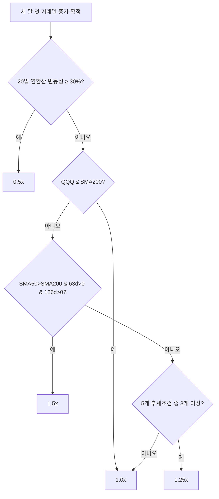
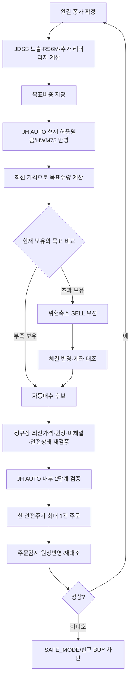

# JDSS 3.2.2 전략 가이드

> 이 문서는 **운영자·비개발자가 JDSS 전략을 이해하는 단일 가이드**입니다. 상단은 3분 요약, 아래는 상세 설명입니다. 정확한 전략 수학은 [`JDSS_FINAL_SPEC.md`](JDSS_FINAL_SPEC.md)와 [`../strategy.yaml`](../strategy.yaml), 실제 자금·자동주문·최초 시작·정지 계약은 [`JH_AUTO_SPEC.md`](JH_AUTO_SPEC.md), 현재 배포상태는 [`../CURRENT_WORK.md`](../CURRENT_WORK.md)를 따릅니다.

## 0. 3분 요약

JDSS 3.2.2는 QQQ를 기본 자산으로 두고 시장이 강할 때만 TQQQ·SOXL로 노출을 높이며, 위험이 커지면 빠르게 감속하는 전략입니다.

- 기본 판단자산: **QQQ**
- 공격자산: **TQQQ**, 조건부 **SOXL**
- 목표 시장노출: **0.5 / 1.0 / 1.25 / 1.5x**
- 반도체 사용조건: **RS6M** — SOXX의 약 6개월 수익률이 양수이고 QQQ보다 강할 때
- 추가 레버리지: H40-S3 가상 사이클이 켜질 때 QQQ 일부를 TQQQ/SOXL로 **최대 5%** 교체
- 위험예산: **HWM75** — 최고점 이익 전부가 아니라 75%만 추가 위험확대에 반영
- 위험철학: **빠른 위험축소·느린 위험확대**

JDSS는 **무엇을 얼마나 보유할지** 결정합니다. JH AUTO는 운영자가 정한 자금 범위에서 **실제로 주문해도 되는지**를 결정합니다.

```text
JDSS 목표비중
→ JH AUTO 현재 허용원금/HWM75 적용
→ 실제 보유·미체결과 비교
→ 위험축소 SELL 우선
→ 신규 BUY 후보
→ 주문 직전 안전조건 재검증
→ 조건 충족 시 자동 실행
```

JDSS의 `$50,000`은 **공식 연구·백테스트 비교용 기준값**입니다. 실거래 고정원금이 아니며 실제 운용자금은 Telegram에서 운영자가 설정합니다.

---

## 1. 전략의 큰 그림

JDSS 3.2.2는 네 단계로 목표비중을 만듭니다.

1. **시장 속도 조절** — QQQ를 기준으로 0.5 / 1.0 / 1.25 / 1.5x 중 하나 선택
2. **반도체 선택** — 레버리지 부분을 TQQQ에 둘지 TQQQ·SOXL로 나눌지 결정
3. **최대 5% 추가 레버리지** — H40-S3 가상 사이클이 활성일 때 QQQ 일부를 3배 ETF로 교체
4. **HWM75** — 현재 위험원금과 최고 평가액을 이용해 위험예산 상한 결정

## 2. 시장 노출 0.5 / 1.0 / 1.25 / 1.5x

새 달 첫 거래일 종가가 완전히 확정된 뒤 기본 목표노출을 판단하고, 월중 위험증가보다 위험축소를 쉽게 허용합니다.

### 2.1 변동성 브레이크

QQQ의 20거래일 일간수익률 표준편차를 연환산한 값이 **30% 이상**이면 목표노출을 **0.5x**로 낮춥니다. 월중 새로 30%를 넘어도 감속하며 같은 달 안에서는 쉽게 재가속하지 않습니다.

### 2.2 장기 추세와 추세 투표

- QQQ 종가 ≤ SMA200 → **1.0x**
- SMA50 > SMA200이고 63일·126일 수익률이 모두 양수 → **1.5x**
- 아래 5개 조건 중 3개 이상 → **1.25x**
- 나머지 → **1.0x**

5개 조건:

1. 21거래일 수익률 > 0
2. 63거래일 수익률 > 0
3. 126거래일 수익률 > 0
4. SMA50 > SMA200
5. SMA200의 21거래일 기울기 > 0

지표 warmup이 충분하지 않으면 1.0x를 사용합니다.



## 3. 목표 노출을 ETF 비중으로 바꾸는 법

1.0x를 넘는 부분은 3배 ETF로 합성합니다.

```text
3배 ETF 비중 = (목표 노출 - 1) / 2
```

| 목표 노출 | QQQ | 3배 ETF 부분 | 현금 |
|---:|---:|---:|---:|
| 0.5x | 50% | 0% | 50% |
| 1.0x | 100% | 0% | 0% |
| 1.25x | 87.5% | 12.5% | 0% |
| 1.5x | 75% | 25% | 0% |

예: QQQ 75% + TQQQ 25%는 `0.75×1 + 0.25×3 = 1.5x`입니다.

## 4. RS6M: SOXL을 언제 쓰는가

SOXX와 QQQ의 126거래일 수익률을 비교합니다.

**RS6M ON** 조건:

- SOXX 126일 수익률 > 0
- SOXX 126일 수익률 > QQQ 126일 수익률

동작:

- OFF → 3배 ETF 부분을 TQQQ 100%
- ON → 3배 ETF 부분을 TQQQ 50% + SOXL 50%
- 월중 조건 상실 → SOXL 부분을 TQQQ로 후퇴
- 한 번 SOXL에서 이탈한 달 → 다음 월 reset 전까지 SOXL 재진입 금지

SOXL은 항상 보유하는 자산이 아니라 **반도체의 중기 상대강도가 확인될 때만 제한적으로 사용하는 자산**입니다.

## 5. 최대 5% 추가 레버리지

기존 H40-S3의 CCI·RSI·볼린저밴드·반등·거래량·ATR 점수와 가상 사이클은 계속 계산하지만 별도 독립 포지션으로 주문하지 않습니다.

- TQQQ 가상 사이클만 활성 → QQQ 최대 5%를 TQQQ로 교체
- SOXL 가상 사이클만 활성 → QQQ 최대 5%를 SOXL로 교체
- 둘 다 활성 → 총 5%를 2.5%씩 분배

가상 active 상태는 미래 데이터 사용을 막기 위해 한 거래일 지연해 반영합니다.

## 6. HWM75: 수익 전부를 다시 위험에 걸지 않기

```text
위험예산 = min(
  현재 평가액 E,
  현재 위험원금 P + 0.75 × max(0, 최고 평가액 H - P)
)
```

JDSS 공식 백테스트에서는 비교 일관성을 위해 `P=$50,000`을 사용합니다. 실거래 JH AUTO에서는 `P`가 **현재 자금투입 단계까지 실제로 열린 현재 허용원금**입니다.

예:

```text
운용 기준자금       $50,000
자동운용비율            20%
목표 자동원금       $10,000
1단계 현재 허용원금  $5,000
```

최종적으로 현재 허용원금이 `$10,000`이 된 뒤 최고 자동운용자산이 `$12,000`이라면 HWM75 현재 위험예산은 약 `$11,500`입니다.

핵심은 다음과 같습니다.

- 이익의 25%는 추가 위험확대에서 제외
- 손실이 나도 외부 개인현금을 자동 투입해 원금을 복구하지 않음
- 운용 기준자금·자동운용비율 변경은 투자수익으로 계산하지 않음
- 연구 기준 `$50,000`과 실거래 자금설정을 혼동하지 않음

## 7. 실제 하루 주문 흐름



현재 JH AUTO 자동 allocation 주문은 **미국 정규장**에서만 실행합니다. 정상 AUTO 운영에서 운영자가 개별 BUY마다 최종승인 버튼을 누르는 것은 기본 경로가 아닙니다. 기존 review/execution approval 코드는 JH AUTO 내부 2단계 검증으로 재사용합니다.

## 8. 최초 실전 자금개방

JH AUTO는 목표 자동원금 전체를 첫날 한 번에 열지 않습니다. 현행 공식 단계는 **50% → 75% → 100%**입니다.

정확한 단계 승격조건·증액·감액·실제 체결증거 요건은 [`JH_AUTO_SPEC.md`](JH_AUTO_SPEC.md)가 소유합니다. 이 가이드에서는 운영자가 이해해야 할 의미만 설명합니다.

- 새 위험은 단계적으로 연다.
- 시간만 지났거나 정수주 반올림으로 목표가 0주라는 이유만으로 다음 단계로 가지 않는다.
- 증액은 추가 원금만 단계적으로 연다.
- 감액은 위험감소이므로 단계대기 없이 반영한다.

## 9. 실거래 원장과 실제 Toss 계좌

| 구분 | 역할 |
|---|---|
| JH AUTO/JDSS 실거래 원장 | 관리자금·목표·주문·체결·성과의 내부 기준 |
| 실제 Toss 계좌 | 실제 보유·미체결·매수가능금액의 외부 확인 기준 |
| 과거 모의운용 원장 | 시험 기록이며 실거래 수량으로 자동 채택하지 않음 |

QQQ·TQQQ·SOXL은 원장과 Toss를 계속 대조합니다. 둘이 다르면 성공으로 추정하지 않고 신규 BUY를 차단합니다. 같은 Toss 계좌에서 관리종목을 JH AUTO와 동시에 수동매매하지 않는 것이 운영 원칙입니다.

## 10. 대표적인 운영 이상상황

| 상황 | 안전한 처리 |
|---|---|
| 주문 응답이 불명확 | `UNKNOWN` → 자동 재전송 금지·신규 BUY 차단 |
| BUY 미체결이 오래 지속 | 취소 요청 → 원주문 상태 재확인 → 불명확하면 SAFE_MODE |
| 위험축소 SELL 부분체결·미완료 | 신규 BUY 차단 |
| Toss/원장 보유 불일치 | 신규 BUY 차단·계좌·원장 대조 |
| 검토 이후 가격·수량 변경 | 기존 내부 approval 폐기 후 최신값 재계산 |
| 서버 재시작 | startup quarantine에서 주문·계좌·원장 재검증 |
| 운영자 `/halt` | durable latch 설정·시스템 자동해제 금지 |
| 오래된 Telegram 설정 버튼 | 현재 상태와 다르면 거부하고 새 검토 생성 |
| 이중 runtime | 동일 live 원장 실행잠금으로 두 번째 프로세스 차단 |

세부 안전 불변식은 [`infra/SECURITY.md`](infra/SECURITY.md)가 소유합니다.

## 11. 공식 과거검증

최근 공식 V3.2.2 재현 조건:

- 기간: 2011-01-01 ~ 2026-08-24
- 연구 기준 초기자금: **$50,000**
- 매수·매도 수수료: 각 0.1%
- 가격 미끄러짐: 0.1%
- 다음 거래시간 체결
- HWM75
- SGOV OFF
- 최초 자금개방 50% → 75% → 100% 반영

| 지표 | V3.2.2 |
|---|---:|
| 누적수익률 | **+2,111.20%** |
| CAGR | **21.89%** |
| MDD | **-30.94%** |
| Sharpe | **0.987** |
| Sortino | **1.295** |
| Calmar | **0.708** |
| 평균 시장노출 | **80.65%** |
| 목표비중 조정 체결 | **861건** |

최근 연도:

| 연도 | V3.2.2 |
|---|---:|
| 2022 | -27.88% |
| 2023 | +58.88% |
| 2024 | +32.49% |
| 2025 | +18.98% |
| 2026 YTD (8/24) | +23.33% |

자동 회귀검사는 데이터 공급자의 수정주가 소폭 변경을 감안해 CAGR 21.7~22.8%, MDD -31.6~-30.3%, Sharpe 0.94~1.07의 좁은 재현 범위를 사용합니다.

### QQQ 단순보유 비교

같은 기간 QQQ 단순보유를 기준선으로 함께 비교합니다. 과거 동일 조건에서 JDSS 3.2.2가 장기 CAGR과 MDD에서 우위였지만 **매년 QQQ를 이긴 것은 아닙니다.** 이 비교는 동일 시장기간에서 수익·낙폭·위험조정 성과를 평가하기 위한 기준입니다.

**과거검증은 미래수익을 보장하지 않습니다.**

## 12. 장점과 한계

### 장점

- 상승 추세에서 제한적으로 레버리지를 사용하고 고변동 시 빠르게 감속합니다.
- SOXL은 반도체 상대강도가 있을 때만 제한적으로 사용합니다.
- HWM75로 이익 전부를 다시 위험에 노출하지 않습니다.
- 위험축소 SELL을 BUY보다 먼저 처리합니다.
- 실제 BUY는 운영자가 정한 자금범위와 다중 안전경계를 모두 통과해야 합니다.

### 한계

- 매년 QQQ를 이기는 전략이 아닙니다.
- TQQQ·SOXL은 급락·횡보장에서 손실과 변동성 드래그가 큽니다.
- 정수주 때문에 아주 작은 자동운용 원금에서는 목표비중 재현오차가 커질 수 있습니다.
- 브로커 주문 결과가 본질적으로 불명확한 경우 완전 무인 복구보다 안전정지를 우선합니다.
- 과거검증은 미래수익을 보장하지 않습니다.

## 13. 강건성 경고

- SOXL sleeve·RS lookback·대체 proxy·월 reset 날짜 주변값에서도 즉시 붕괴하는 단일점 구조는 아니었습니다.
- 비용을 높인 조건에서도 장기 방향성은 유지됐습니다.
- 2023년 이후 데이터는 후보선택 과정에서 반복 관찰되어 완전히 독립된 검증기간이 아닙니다.
- 과거 조합검증 기준 과최적화 확률 추정치는 약 **64.29%**로 경고 수준입니다.
- 새 연구는 [`research/RESEARCH_PROTOCOL.md`](research/RESEARCH_PROTOCOL.md)의 독립검증·인접값·재표본검증 기준을 따릅니다.

## 14. 평소 운영 체크리스트

- `/dashboard`: 전체 자동운용 상태·수익률·자금범위 확인
- `/today`: 오늘 목표수량과 자동매수/위험축소 필요량 확인
- `/auto`: 운용 기준자금·자동운용비율·자금개방 단계 확인/변경
- `/portfolio`: 종목별 보유·평가손익·수익률 확인
- `/account`: 실제 Toss 계좌 확인
- `/halt`: 이상 시 신규 BUY 즉시 차단
- 주문 결과가 불명확하면 재주문하지 않고 상태확인
- 배포와 `/auto start`를 같은 행위로 해석하지 않음

Telegram의 정확한 명령·상태·메시지는 [`TELEGRAM_BOT_GUIDE.md`](TELEGRAM_BOT_GUIDE.md)를 따릅니다.

## 15. 미니 용어사전

| 용어 | 뜻 |
|---|---|
| JDSS 3.2.2 | 시장상태와 QQQ/TQQQ/SOXL 목표비중을 결정하는 투자전략 |
| JH AUTO 1.0.0 | 실제 자금·주문·안전·성과를 관리하는 자동매매 실행계층 |
| 운용 기준자금 | 운영자가 Telegram에서 정하는 실거래 기준 원금 |
| 자동운용비율 | 운용 기준자금 중 JH AUTO에 위임할 비율 |
| 현재 허용원금 | 현재 자금개방 단계까지 실제 위험예산에 사용할 수 있는 원금 |
| RS6M | 약 6개월 기준 반도체가 QQQ보다 강한지 비교하는 규칙 |
| HWM75 | 최고점 이익의 75%만 위험한도 증가에 반영하는 규칙 |
| UNKNOWN | 주문 요청의 실제 브로커 처리 결과를 확정할 수 없는 상태 |
| 안전정지(SAFE_MODE) | 주문·원장 상태가 불확실할 때 신규 BUY를 막는 보호 상태 |
| 계좌·원장 대조 | 프로그램 기록과 실제 주문·보유 상태가 맞는지 확인하는 절차 |

정확한 전략 변경은 이 가이드가 아니라 `strategy.yaml`과 `JDSS_FINAL_SPEC.md`에서 정의하고 검증합니다.
